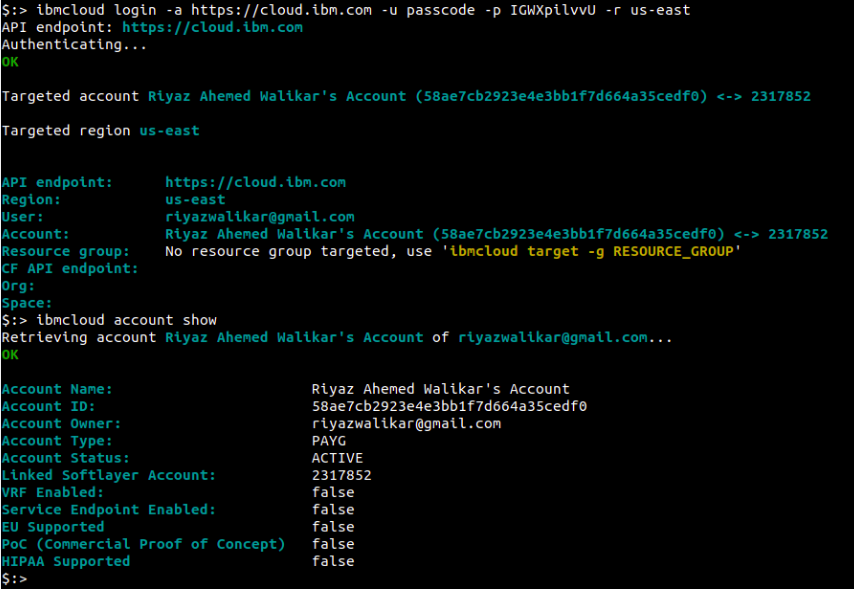
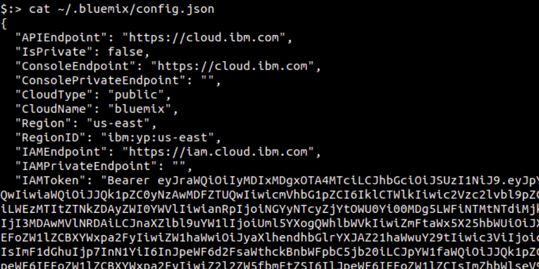

# IBM Cloud CLI

Exploring the IBM Cloud CLI on your local computer, what files it creates, where the tokens are stored etc.

## Observations

- IBM Cloud cli installer is well documented
- Additional plugins are required to access functionality, for example storage
- Various login methods supported. I used the `One time passcode` to login most of the times as this was available via the web interface

### Setting up access using the CLI

- Click Profile icon > Log in to CLI and API

- `whoami` of the IBM Cloud CLI world - `ibmcloud account show`

- You can also use an API key to login and generate the `IAMToken` required for the CLI

- Or if you want to use the REST API, you could make a POST request to the [https://iam.cloud.ibm.com/identity/token](https://iam.cloud.ibm.com/identity/token) endpoint with the grant type and the API key
- `curl -X POST -d 'grant_type=urn:ibm:params:oauth:grant-type:apikey&apikey=<API-KEY-HERE>' -H 'Content-Type: application/x-www-form-urlencoded' 'https://iam.cloud.ibm.com/identity/token'`

### Local tokens

- Post login using the CLI, the IAMToken is stored in the `~/.bluemix/config.json` file

## To do

1. TBD

## References

- [https://cloud.ibm.com/docs/cloud-object-storage?topic=cloud-object-storage-curl](https://cloud.ibm.com/docs/cloud-object-storage?topic=cloud-object-storage-curl)
- [https://www.ibm.com/cloud/blog/using-ibm-cloud-shell-for-ibm-cloud-kubernetes-service-and-red-hat-openshift-on-ibm-cloud](https://www.ibm.com/cloud/blog/using-ibm-cloud-shell-for-ibm-cloud-kubernetes-service-and-red-hat-openshift-on-ibm-cloud)
