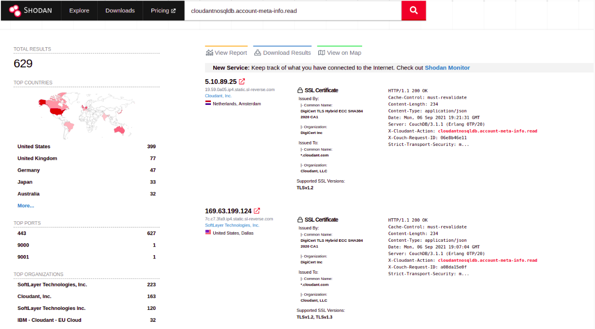

# IBM Cloud Databases

Exploring the IBM Cloud Database services and recording interesting observations

## Observations

- IBM Cloud supports multiple types of managed databases. About 21 different types like Cloudant JSON, PostgreSQL, MongoDB, DB2, Redis and others
- Picked the first one and started to see how it looks like - Cloudant JSON

### IBM Cloudant

- This is a fully managed JSON document database that offers independent serverless scaling of provisioned throughput capacity and storage
- Provides an HTTPS endpoint post creation, no authentication by default!
- The URL is of the format - `https://<random-UUID>-bluemix.cloudant.com/`. For example, `https://ecd5a921-3bbc-4870-b4ce-c2c4bbbe8018-bluemix.cloudant.com/`

### Finding IBM Cloudant databases in the wild

- Domain name is not useful in searching for datbases
- Response header inspection using `cURL` showed unique strings that allow searching for Cloudant exposed database dashboards on the Internet
- Bunch of them without any authentication!
- Look for `cloudantnosqldb.account-meta-info.read` in response headers. Shodan has promising results!

## To do

1. Profile the external footprint of the other managed databases. This includes
    - Domain names
    - Header information and unique signatures
    - Error messages
2. Identify credential requirements, which of them allow unauthenticated access by default?

## References

- [https://cloud.ibm.com/apidocs/cloudant](https://cloud.ibm.com/apidocs/cloudant)
