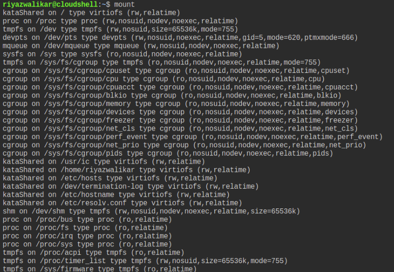
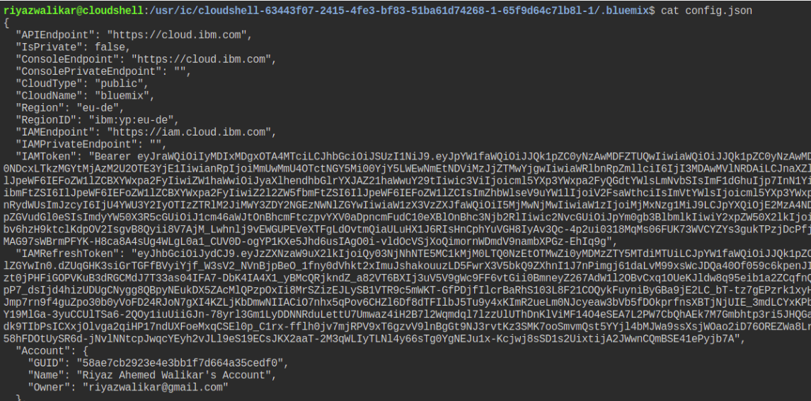

# IBM Cloud Shell

Exploring the IBM Cloud shell environment and any interesting things that I came across.

## Observations

- You can access the IBM Cloud shell by navigating to [https://cloud.ibm.com/shell](https://cloud.ibm.com/shell) or by clicking the shell icon when logged into IBM Cloud web console.
- The IBM Cloud shell is a Bluemix container orchestration pod based on Kubernetes as evidenced by multiple tell-a-tale signs within the shell environment

### Quick overview of Cloud Shell internals

Looking at the output of `cat /proc/1/cgroup` and `mount` we know its a kata container environment.

- Quick commands to verify container orchestration type - `cat /proc/1/cgroup`

- Output of `mount`

The IBM Cloud shell is fully authenticated with the account using a IAM token created upon initialization and stored in the `/usr/ic/cloudshell-<cloudshell-session-id>/.bluemix/config.json` file

This token has full account privileges and can be used with the IBM Cloud REST API. An example query to show bucket listing using the IAM Token obtained from within the cloud shell would be

- `curl -s -H "Authorization: Bearer <IAM-TOKEN-HERE> -H "ibm-service-instance-id: <IBM-SERVICE-INSTANCE-ID>" "https://s3.us-east.cloud-object-storage.appdomain.cloud/"`

## To do

1. The IBM Cloud shell appears to have internal network access, capabilities and setuid binaries that could potentially be used to gain root and escape the container.

## References

- [https://cloud.ibm.com/docs/cloud-object-storage?topic=cloud-object-storage-curl](https://cloud.ibm.com/docs/cloud-object-storage?topic=cloud-object-storage-curl)
- [https://www.ibm.com/cloud/blog/using-ibm-cloud-shell-for-ibm-cloud-kubernetes-service-and-red-hat-openshift-on-ibm-cloud](https://www.ibm.com/cloud/blog/using-ibm-cloud-shell-for-ibm-cloud-kubernetes-service-and-red-hat-openshift-on-ibm-cloud)
