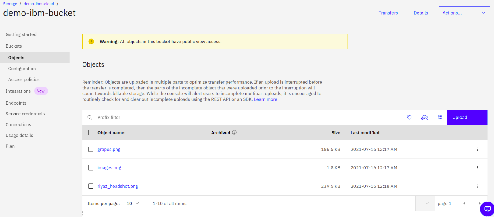
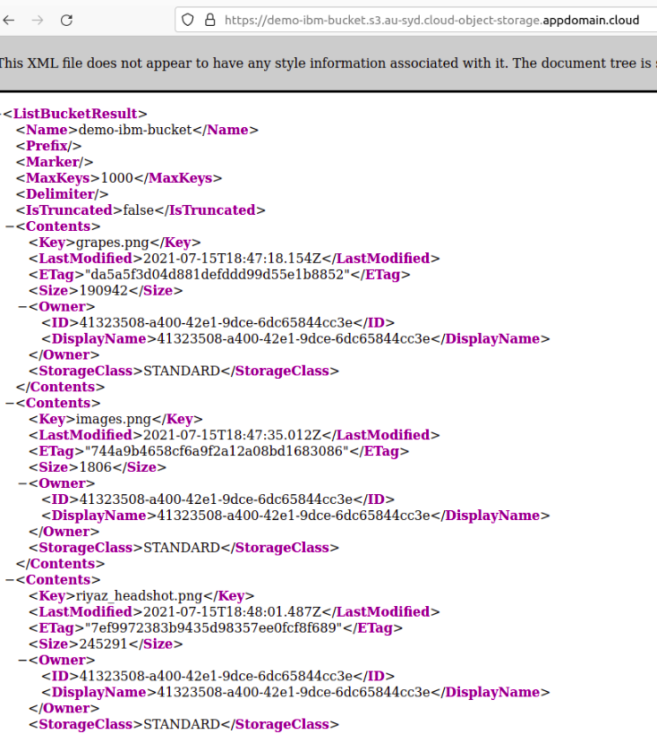
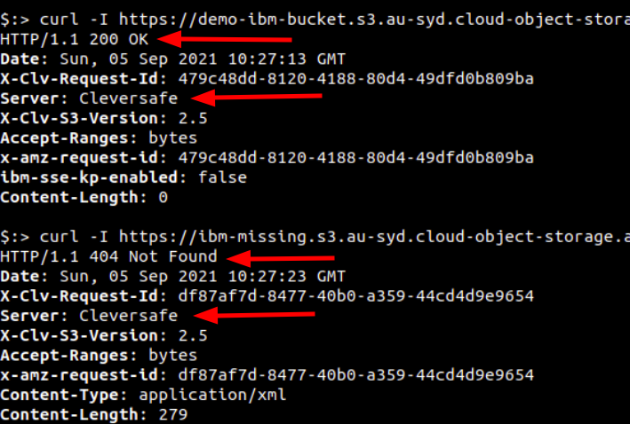
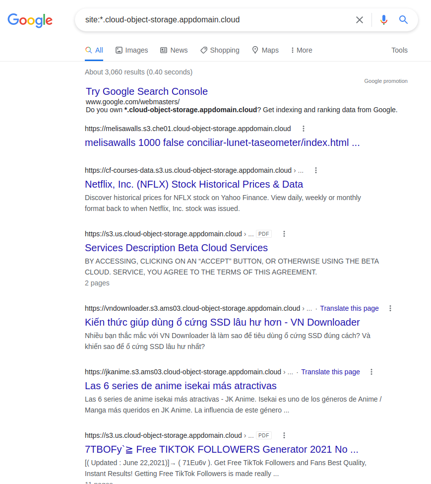
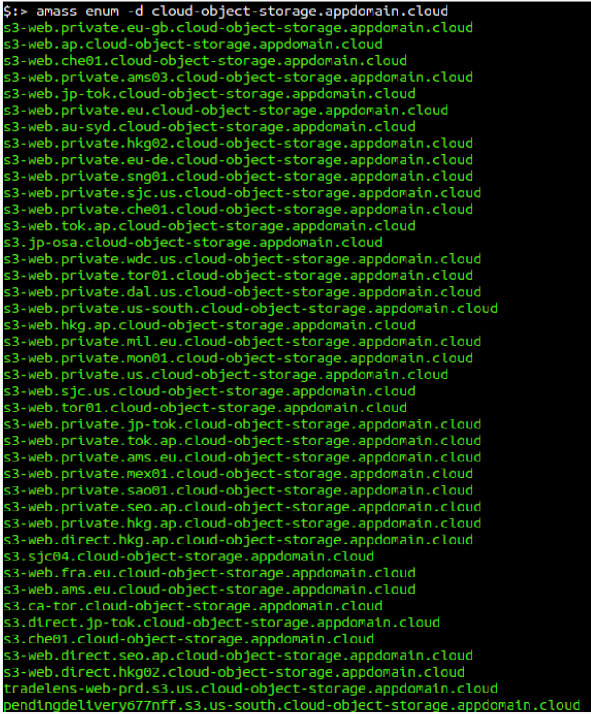

# IBM Cloud storage related things

Things uncovered when looking at IBM Cloud storage, the kind of storage types available, object storage, naming convention, tools to discover etc.

## Observations

- Two basic types: Object Storage (much like AWS S3) and File System Storage Types - Block Storage (SAN based, raw blocks) and File Storage (NAS based, pre formatted FS)
- The Object Storage supports creation of `buckets` inside which you place objects
- The bucket and the objects within can have independent permissions, much like AWS S3
- Buckets CNAME can be accessed publicly, however, actual HTTP layer access can be restricted using policies AND/OR IP address whitelisting
- Naming convention: `<bucket-name>.s3.<region>.cloud-object-storage.appdomain.cloud`
- You can integrate IBM Cloud SQL Query with uploaded objects, so that if they are of a supported type (CSV, JSON, Parquet etc.) then you can query the data within the file using SQL queries (similar to AWS Athena).

### Examples of IBM Cloud Storage

- A bucket called `demo-ibm-bucket` with 3 objects inside which have public view access.



- Public bucket in the Australia Sydney region showing file listing over HTTP



- `cURL` request shows the string `Server: Cleversafe` in the response headers. Cleversafe Inc. was acquired by IBM in Nov 2015 and rebranded into IBM Cloud Storage. Also note the 200 OK and 404 Not Found, distinct errors make it easy to discover buckets using any subdomain enumeration tool.



## Setting up CLI access to work with object storage

Install the IBM Cloud CLI and run the following commands

```bash
ibmcloud plugin install cloud-object-storage
ibmcloud login -a https://cloud.ibm.com -u passcode -p <password> -r us-east
ibmcloud cos config auth --method IAM
ibmcloud resource service-instances
ibmcloud resource service-instance <instance-name> --id
ibmcloud cos config crn (enter CRN from Step 5 after the ::)
ibmcloud cos buckets
ibmcloud cos objects --bucket <bucket-name> --region <region>
```

## Identifying public buckets in IBM Cloud Storage

- We know the DNS naming convention
- We know distinct HTTP Response status codes when bucket exists, does not exist and when not public etc.
- Naming convention: `<bucket-name>.s3.<region>.cloud-object-storage.appdomain.cloud`

Two quick ways to enumerate public buckets/objects based on what we know

- Google sub domain search - `site:*.cloud-object-storage.appdomain.cloud`



- Any subdomain brute force tool - `amass`, `sublist3r`, `SecurityTrails` etc.



## To do

1. Access policies for IBM Cloud Storage, for buckets and objects
2. Check for volume and snapshot storage and their permissions (equivalent in IBM Cloud)

## References

- [https://cloud.ibm.com/docs/cloud-object-storage?topic=cloud-object-storage-getting-started-cloud-object-storage](https://cloud.ibm.com/docs/cloud-object-storage?topic=cloud-object-storage-getting-started-cloud-object-storage)
- [https://github.com/OWASP/Amass/blob/master/doc/user_guide.md](https://github.com/OWASP/Amass/blob/master/doc/user_guide.md)
