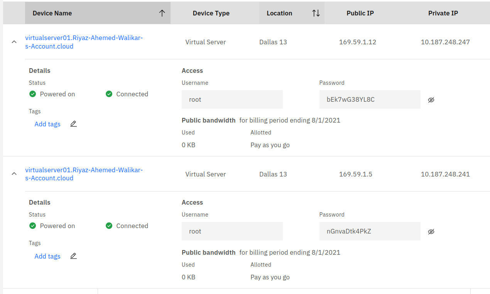

# IBM Cloud Virtual Server for Classic

IBMs previous generation of virtual machines on x86 available in all IBM Cloud locations worldwide.

## Observations

- Older way to run virtual machines in IBM Cloud. The newer way is using the the Virtual Servers for VPC.
- Virtual Server for Classic is accessible under Catalog > Compute > Virtual Server for Classic
- Supported OS types include CentOS, Debian, Microsoft Windows variants and Ubuntu
- The list contains some End of Life operating systems (Ubuntu 16.04 LTS) as well as some that are in the Extended Support period (Windows 2012 Standard)

### Password Manager Password Storage

- The password manager caught my attention as it had what appeared to be the `root` password of the machine I had just started
- Regardless of whether you provide an SSH key or not, the `root` password was available in the password manager without additional authentication
- Turns out, IBM stores this password and it does not require a private key to decrypt like the Remote Desktop password on AWS for Windows machines
- Any other password added to this password manager, also get stored and can be accessed without additional authentication

## To do

1. TBD

## References

- [https://cloud.ibm.com/docs/virtual-servers?topic=virtual-servers-about-virtual-servers](https://cloud.ibm.com/docs/virtual-servers?topic=virtual-servers-about-virtual-servers)
