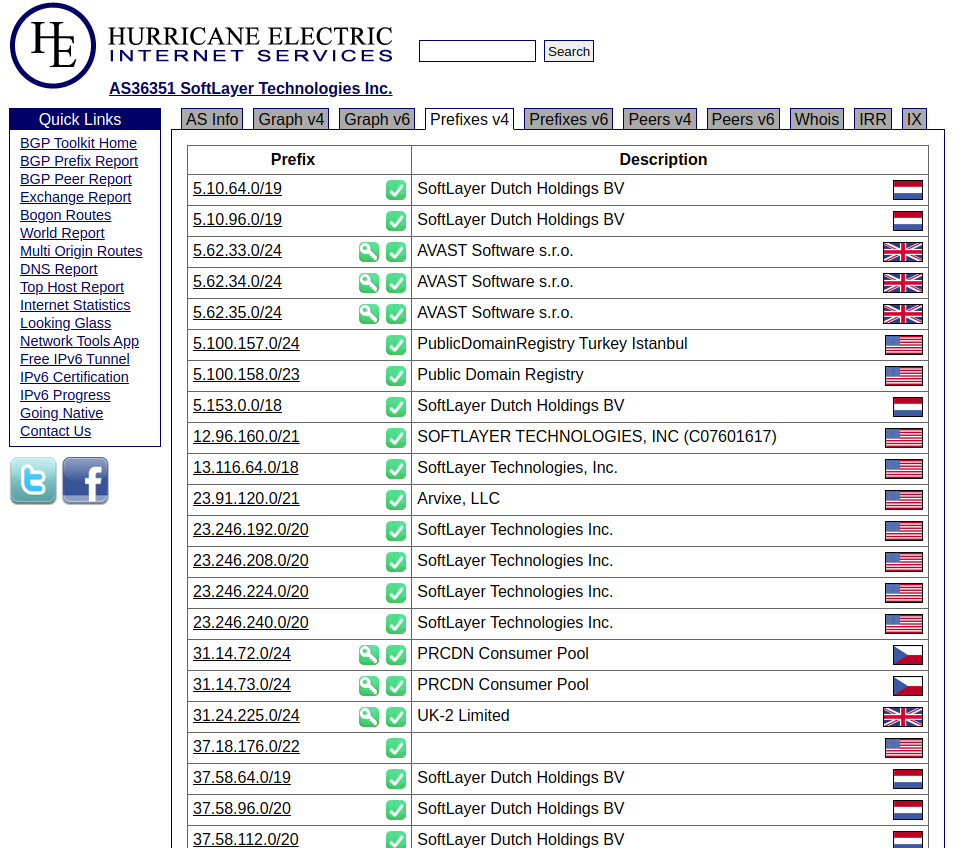
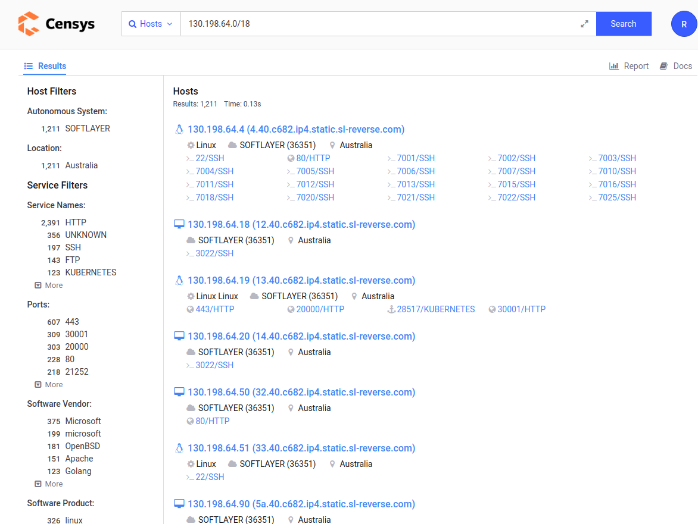

# Public OSINT and identifying IBM cloud things

Things uncovered while trying to identify the external footprint of IBM Cloud. Contains potential IP ranges, examples of Shodan/Censys findings etc.

## Identifying Public IP ranges for IBM Cloud

The following is a list of IP address ranges that were identified using crude reverse searches. The list is not complete.

- [Public IP ranges for IBM Cloud](ip-ranges.txt)

### Approach to finding public IPs

- Started with Googling for "IBM Cloud IP ranges" and similar keywords
- Found [https://cloud.ibm.com/docs/vsrx?topic=hardware-firewall-shared-ibm-cloud-ip-ranges](https://cloud.ibm.com/docs/vsrx?topic=hardware-firewall-shared-ibm-cloud-ip-ranges) which has a list of IP ranges but this reads more like the product documentation for the IBM Cloud Juniper vSRX appliance firewall than the IBM Cloud in general
- Used a reverse search from public IP to IP owner and then look at the neighborhood

#### Steps to do this

- Create a floating IP (or any other resource within IBM that gives us a public IP)

- Search this IP in the potential IP address list from IBM, create additional floating IPs to look for in the list. None of the CIDRs are visible.
- Looking at the ASN for the IP `169.63.185.70`, it belongs to `AS36351`, which is `SoftLayer Technologies, Inc.`. This was acquired by IBM In 2013 to form a part of IBM Cloud.
- The IPv4 Prefixes for `AS36351` gives a larger list that needs some verification and cleaning.

You can use these CIDRs to find servers/cloud resources and any open ports they may have to the Internet using services like Censys or Shodan

## To do

1. Look at managed services within IBM and see if public IP ranges match AS36351
2. Create sublists of IP ranges reserved for managed services (IPs that will never become floating IPs)
3. What's visible for these IP sublists via public discovery, are there public databases, containers etc.?
4. For the IPs already obtained, sort them based on IBM Cloud supported regions

## References

- [https://cloud.ibm.com/docs/vsrx?topic=hardware-firewall-shared-ibm-cloud-ip-ranges](https://cloud.ibm.com/docs/vsrx?topic=hardware-firewall-shared-ibm-cloud-ip-ranges)
- [https://bgp.he.net/AS36351#_prefixes](https://bgp.he.net/AS36351#_prefixes)
- [https://search.censys.io/search?resource=hosts&q=130.198.64.0%2F18](https://search.censys.io/search?resource=hosts&q=130.198.64.0%2F18)
